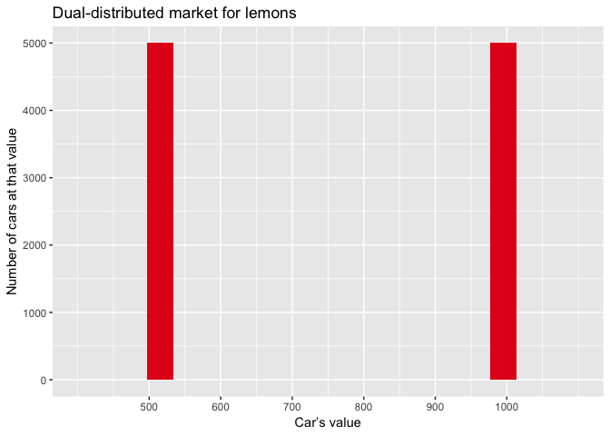
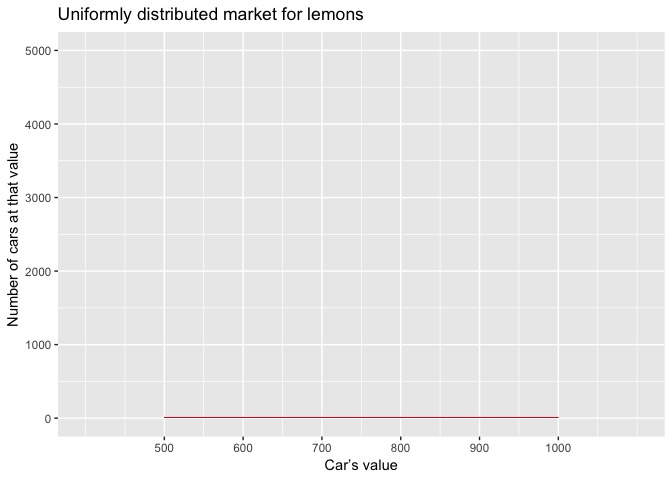
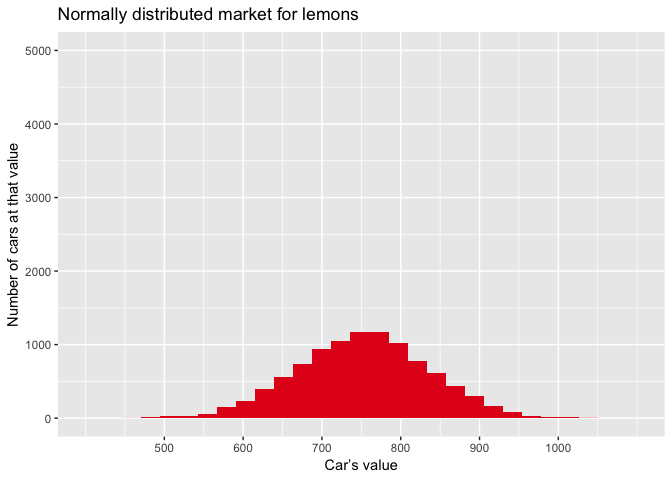

Two ways to shrink three market for lemons
================

Dual market, no asymmetry
-------------------------

Half the cars are worth $500, and half are worth $1000. There is no information asymmetry between buyers and sellers. A given buyer's offer is always equal to the value of the car in question.

``` r
lemon_value <- 500
peach_value <- 1000
num_cars <- 10000
market <- data.frame(value = c(rep.int(lemon_value, times=num_cars/2), rep.int(peach_value, times=num_cars/2)))
market <- market %>%
        mutate(buyer_offer = value) %>%
        mutate(will_it_sell = (buyer_offer >= value))
market %>% ggplot(aes(x=value)) +
        geom_histogram(fill = "#e41a1c", bins=20) +
        scale_y_continuous(limits = c(0,5000)) + 
        scale_x_continuous(breaks = c(500,600,700,800,900,1000), limits = c(400,1100)) +
        theme(plot.subtitle = element_text(vjust = 1), 
              plot.caption = element_text(vjust = 1)) +
        labs(title = "Dual-distributed market for lemons", 
             x = "Car’s value", y = "Number of cars at that value")
```



``` r
ggsave(filename = "../results/dual_market.png")
```

    ## Saving 7 x 5 in image

``` r
dual_no_asym <- sum(market$value[market$will_it_sell == TRUE]) - sum(market$value[market$will_it_sell == FALSE])

print(paste0("Market value: ", dual_no_asym))
```

    ## [1] "Market value: 7500000"

Dual market, partial asymmetry
------------------------------

Half the cars are worth $500, and half are worth $1000. There is partial information asymmetry between buyers and sellers. A given buyer's offer is randomly sampled from a normal distribution centred at the midpoint between the average value of all cars ($750) and the true value of the car in question.

``` r
for (i in 1:dim(market)[1]) {
        market$buyer_offer[i] <- rnorm(n = 1, mean = mean(c(market$value[i], mean(market$value))), sd = abs(mean(market$value)-market$value[i])/3)
}
market <- market %>% mutate(will_it_sell = (buyer_offer >= value))

dual_part_asym <- sum(market$value[market$will_it_sell == TRUE]) - sum(market$value[market$will_it_sell == FALSE])

print(paste0("Market value: ", dual_part_asym))
```

    ## [1] "Market value: -2130000"

Dual market, complete asymmetry
-------------------------------

Half the cars are worth $500, and half are worth $1000. There is complete information asymmetry between buyers and sellers. A given buyer's offer is always the average value of all cars ($750).

``` r
market <- market %>%
        mutate(buyer_offer = mean(value)) %>%
        mutate(will_it_sell = (buyer_offer >= value))

dual_full_asym <- sum(market$value[market$will_it_sell == TRUE]) - sum(market$value[market$will_it_sell == FALSE])

print(paste0("Market value: ", dual_full_asym))
```

    ## [1] "Market value: -2500000"

Uniform market, no asymmetry
----------------------------

The cars are uniformly distributed between $500 and $1000. There is no information asymmetry between buyers and sellers. A given buyer's offer is always equal to the value of the car in question.

``` r
market <- data.frame(value = seq.int(from = lemon_value, to = peach_value, by = (peach_value-lemon_value)/(num_cars+1)))
market <- market %>%
        mutate(buyer_offer = value) %>%
        mutate(will_it_sell = (buyer_offer >= value))
market %>% ggplot(aes(x=value)) +
        geom_histogram(fill = "#e41a1c", bins = 1001) +
        scale_y_continuous(limits = c(0,5000)) + 
        scale_x_continuous(breaks = c(500,600,700,800,900,1000), limits = c(400,1100)) +
        theme(plot.subtitle = element_text(vjust = 1), 
              plot.caption = element_text(vjust = 1)) +
        labs(title = "Uniformly distributed market for lemons", 
             x = "Car’s value", y = "Number of cars at that value")
```



``` r
ggsave(filename = "../results/uniform_market.png")
```

    ## Saving 7 x 5 in image

``` r
unif_no_asym <- sum(market$value[market$will_it_sell == TRUE]) - sum(market$value[market$will_it_sell == FALSE])

print(paste0("Market value: ", unif_no_asym))
```

    ## [1] "Market value: 7501500"

Uniform market, partial asymmetry
---------------------------------

The cars are uniformly distributed between $500 and $1000. There is partial information asymmetry between buyers and sellers. A given buyer's offer is randomly sampled from a normal distribution centred at the midpoint between the average value of all cars ($750) and the true value of the car in question.

``` r
for (i in 1:dim(market)[1]) {
        market$buyer_offer[i] <- rnorm(n = 1, mean = mean(c(market$value[i], mean(market$value))), sd = abs(mean(market$value)-market$value[i])/3)
}
market <- market %>% mutate(will_it_sell = (buyer_offer >= value))

unif_part_asym <- sum(market$value[market$will_it_sell == TRUE]) - sum(market$value[market$will_it_sell == FALSE])

print(paste0("Market value: ", unif_part_asym))
```

    ## [1] "Market value: -1172541.99580042"

Uniform market, complete asymmetry
----------------------------------

The cars are uniformly distributed between $500 and $1000. There is complete information asymmetry between buyers and sellers. A given buyer's offer is always the average value of all cars ($750).

``` r
market <- market %>%
        mutate(buyer_offer = mean(value)) %>%
        mutate(will_it_sell = (buyer_offer >= value))

unif_full_asym <- sum(market$value[market$will_it_sell == TRUE]) - sum(market$value[market$will_it_sell == FALSE])

print(paste0("Market value:", unif_full_asym))
```

    ## [1] "Market value:-1250375.01249875"

Normal market, no asymmetry
---------------------------

The cars are normally distributed between $500 and $1000. There is no information asymmetry between buyers and sellers. A given buyer's offer is always equal to the value of the car in question.

``` r
market <- data.frame(value = rnorm(n = num_cars, mean = mean(c(lemon_value, peach_value)), sd = (peach_value-mean(c(lemon_value, peach_value)))/3))
market <- market %>%
        mutate(buyer_offer = value) %>%
        mutate(will_it_sell = (buyer_offer >= value))
market %>% ggplot(aes(x=value)) + 
        geom_histogram(fill = "#e41a1c", bins=30) +
        scale_y_continuous(limits = c(0,5000)) + 
        scale_x_continuous(breaks = c(500,600,700,800,900,1000), limits = c(400,1100)) +
        theme(plot.subtitle = element_text(vjust = 1), 
              plot.caption = element_text(vjust = 1)) +
        labs(title = "Normally distributed market for lemons", 
             x = "Car’s value", y = "Number of cars at that value")
```



``` r
ggsave(filename = "../results/normal_market.png")
```

    ## Saving 7 x 5 in image

``` r
norm_no_asym <- sum(market$value[market$will_it_sell == TRUE]) - sum(market$value[market$will_it_sell == FALSE])

print(paste0("Market value: ", norm_no_asym))
```

    ## [1] "Market value: 7515023.14851694"

Normal market, partial asymmetry
--------------------------------

The cars are uniformly distributed between $500 and $1000. There is partial information asymmetry between buyers and sellers. A given buyer's offer is randomly sampled from a normal distribution centred at the midpoint between the average value of all cars ($750) and the true value of the car in question.

``` r
for (i in 1:dim(market)[1]) {
        market$buyer_offer[i] <- rnorm(n = 1, mean = mean(c(market$value[i], mean(market$value))), sd = abs(mean(market$value)-market$value[i])/3)
}
market <- market %>% mutate(will_it_sell = (buyer_offer >= value))

norm_part_asym <- sum(market$value[market$will_it_sell == TRUE]) - sum(market$value[market$will_it_sell == FALSE])

print(paste0("Market value: ", norm_part_asym))
```

    ## [1] "Market value: -690898.949951419"

Normal market, complete asymmetry
---------------------------------

The cars are normally distributed between $500 and $1000. There is complete information asymmetry between buyers and sellers. A given buyer's offer is always the average value of all cars ($750).

``` r
market <- market %>%
        mutate(buyer_offer = mean(value)) %>%
        mutate(will_it_sell = (buyer_offer >= value))

norm_full_asym <- sum(market$value[market$will_it_sell == TRUE]) - sum(market$value[market$will_it_sell == FALSE])

print(paste0("Market value: ", norm_full_asym))
```

    ## [1] "Market value: -751042.5522232"

All markets compared.
---------------------

``` r
all_markets <- data.frame(market_dist = c(rep("Dual", 3), rep("Uniform", 3), rep("Normal", 3)), info_asym = c("None", "Partial", "Full", "None", "Partial", "Full", "None", "Partial", "Full"), market_value = c(dual_no_asym/7500000, dual_part_asym/7500000, dual_full_asym/7500000, unif_no_asym/7500000, unif_part_asym/7500000, unif_full_asym/7500000, norm_no_asym/7500000, norm_part_asym/7500000, norm_full_asym/7500000))

all_markets$market_dist <- factor(all_markets$market_dist, levels = c("Dual", "Uniform", "Normal"))
all_markets$info_asym <- factor(all_markets$info_asym, levels = c("None", "Partial", "Full"))

myColors <- c("#e41a1c", "#377eb8", "#4daf4a")
ggplot(all_markets, aes(x = market_dist, market_value)) +
        geom_bar(aes(fill = info_asym), position = "dodge", stat="identity") + 
        scale_fill_manual(values=myColors) +
        theme(plot.subtitle = element_text(vjust = 1), 
    plot.caption = element_text(vjust = 1)) +labs(title = "Effects of information asymmetries across markets for lemons", 
    x = "Market distribution", y = "Market value", 
    fill = "Information asymmetry") +
        scale_y_continuous(breaks=seq(-0.4,1,.2))
```


``` r
ggsave(filename = "../results/all_markets.png")
```

    ## Saving 7 x 5 in image
